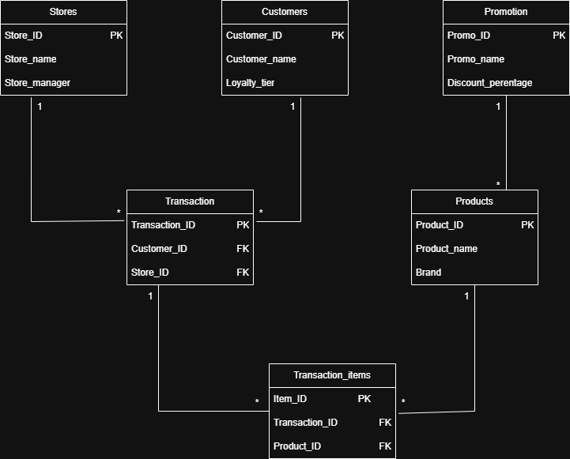

# Imbewu Retail Investigation WC-Revenue Analysis
## 🌱 The Imbewu Investigation
### Capstone Data Analytics Project — Witle Academy

> *"Imbewu means 'seed' in isiZulu and isiXhosa. This project planted the foundations of real analyst thinking."*
---

## 📌 The Problem

**Imbewu Retail** is a fictional South African retail chain operating 45 stores across four provinces (Western Cape, Gauteng, KwaZulu-Natal, and Eastern Cape). The business runs a loyalty programme with three tiers — Bronze, Silver, and Gold — and sells across five product categories: Groceries, Household, Health & Beauty, Apparel, and Electronics.

The Head of Sales flagged a concern:

> *"Something's off in Western Cape. Numbers are down compared to last year, but our store visit reports say foot traffic is roughly flat. That doesn't add up."*

This is a deceptively tricky business problem. Revenue is down, but customers are still walking through the door. That disconnect — **flat visits, falling revenue** — is the core puzzle. The question is not *"are customers disappearing?"* but rather *"why are customers spending less when they do come in?"*

The business needed answers before an executive readout. No pre-built report. No specific KPI to chase. Just a database, a deadline, and an ambiguous question.

---

## 🎯 What I Was Trying to Solve

Working as a simulated Junior Data Analyst on the Commercial Analytics team, I had to:

1. **Translate a vague business concern into testable hypotheses** — before writing a single query
2. **Investigate those hypotheses** using 18 months of transactional data (Jan 2024 – Jun 2025)
3. **Identify the true root cause(s)** of the WC revenue decline
4. **Drill down to individual store level** after the Regional Manager pushed back on province-level analysis
5. **Answer a second stakeholder request mid-project** — evaluate whether a Buy 2 Get 1 Free promotion on Maize Meal actually worked
6. **Communicate findings** in plain language for a non-technical executive audience

---

## 🗃️ The Dataset

Six tables covering 18 months of retail operations:

| Table | Rows | Description |
|---|---|---|
| `stores` | 45 | Store format, province, suburb, manager |
| `products` | 48 | 5 categories, sub-categories, pricing |
| `customers` | 3,000 | Loyalty programme members (Bronze / Silver / Gold) |
| `transactions` | 9,164 | Every till receipt issued |
| `transaction_items` | 48,641 | Line-item detail: quantity, price, discount |
| `promotions` | 4 | Historical marketing campaigns |

The data intentionally contained real-world messiness: inconsistent province casing, NULL customer IDs (anonymous shoppers), missing demographic fields, and a date range that required careful handling for year-over-year comparisons.

### 🗺️ Entity Relationship Diagram



> **Relationships:**
> - `Stores` → `Transactions` (one-to-many via Store_ID)
> - `Customers` → `Transactions` (one-to-many via Customer_ID)
> - `Transactions` → `Transaction_items` (one-to-many via Transaction_ID)
> - `Products` → `Transaction_items` (one-to-many via Product_ID)
> - `Promotion` → `Products` (one-to-many — promo targets a product category)
The data intentionally contained real-world messiness: inconsistent province casing, NULL customer IDs (anonymous shoppers), missing demographic fields, and a date range that required careful handling for year-over-year comparisons.

---

## 🔍 My Approach

### Step 1 — Listen before querying
I re-read the stakeholder message carefully before opening a SQL editor. The phrase *"foot traffic is roughly flat"* was the key signal — it told me this was a **spend-per-visit problem**, not a footfall problem. That single insight shaped the entire investigation.

### Step 2 — Form hypotheses first
Rather than querying randomly, I wrote four testable hypotheses upfront:

| # | Hypothesis | Result |
|---|---|---|
| A | Mega-format stores in WC are underperforming and dragging the provincial average down | ✅ Confirmed |
| B | WC customers are shifting to lower-value product categories, reducing average basket size | ✅ Confirmed |
| C | Silver-tier loyalty customers are visiting less often and spending less per visit | ✅ Confirmed |
| D | WC received fewer promotional activations than other provinces | ⏸️ Deprioritised — A, B, C fully explain the gap |

### Step 3 — Test rigorously, always compare nationally
Every WC finding was benchmarked against the rest of the country. A decline only means something if it's not happening everywhere. All year-over-year comparisons were restricted to H1 (Jan–Jun) in both years to ensure a like-for-like period.

### Step 4 — Go to store level when challenged
When the Regional Manager pushed back ("WC is too broad — we have 12 stores"), I drilled into every individual store. The finding was striking: the decline is not evenly spread. Three Mega stores account for 132% of the gross revenue gap, while four stores are actively growing.

### Step 5 — Answer the second stakeholder request (Pap Power Promo)
Mid-investigation, the Marketing Manager asked for a clean number on whether the April 2025 Maize Meal promotion worked. I scoped it tightly, queried it, and gave a direct yes/no with numbers and one recommendation.

---

## 📊 Key Findings

### Finding 1 — The Decline Is Concentrated in 3 Stores, Not All of WC
- **Mega Bellville: −25.4%** — R18,827 revenue lost in H1 alone
- Mega Paarl Central: −12.1%
- Mega Tygervalley: −6.8%

These 3 stores account for **R31,209 of gross decline — 132% of the total WC gap**. Without them, WC would be in growth. Four stores (Mitchell's Plain +41.7%, Sea Point +31.7%, Khayelitsha +29.6%, Stellenbosch +10.5%) are thriving.

### Finding 2 — Groceries and Household Are Collapsing in WC
- Groceries: **−9.1%** in WC vs **+2.8%** nationally
- Household: **−10.9%** in WC vs **+0.1%** nationally

These are the two largest revenue categories in WC. They are declining *only* in Western Cape. This strongly suggests customers are buying staples elsewhere — a **competitive/channel-shift risk**, most likely concentrated around the Bellville catchment area.

### Finding 3 — Silver-Tier Customers Are Disengaging
- Silver-tier visit frequency: **−9.0%** in WC
- Silver-tier revenue: **−10.7%** in WC
- Nationally, Silver-tier basket grew **+5.6%** in the same period

Gold customers remained stable. Silver customers — representing ~22% of WC loyalty revenue — are both visiting less *and* spending less per trip. This is a **double-compression retention problem** specific to WC.

### Finding 4 — Pap Power Promo: Volume Win, Revenue Draw
- Units sold: **+50.5%** ✅
- Net revenue: **+2.2%** ⚠️
- Discount cost: **R2,500**
- May 2025 volumes crashed −33% — customers stockpiled during the promo, pulling demand forward

The promo moved stock but generated near-zero revenue growth. Recommendation: use 20% off instead of Buy 2 Get 1 Free if repeating.

---

## 📁 Project Deliverables

| File | Description |
|---|---|
| [📄 Week1_Investigation_Plan.docx](Week1_Investigation_Plan.docx) | Hypothesis framework, data profiling, quality decisions |
| [📄 Week2_Deep_Investigation.docx](Week2_Deep_Investigation.docx) | Full findings: Hypotheses A, B, C + Promo evaluation |
| [📄 Week3_StoreLevel_DeepDive.docx](Week3_StoreLevel_DeepDive.docx) | Individual store analysis, bright spots, dashboard plan |
| [🗂️ data_dictionary.md](data_dictionary.md) | **Start here** — full schema documentation and data quality decisions |
| [🔍 investigation.sql](investigation.sql) | All SQL queries grouped by hypothesis, findings inline |
| [📊 imbewu_dashboard.html](imbewu_dashboard.html) | Interactive 4-page dashboard (open in browser) |
```

---

## ⚙️ Tools Used

| Tool | Purpose |
| SQL (Databricks dialect) | Data profiling, hypothesis testing, CTEs, window functions |
| Power BI Desktop | 4-page executive dashboard |
| Microsoft Word | Structured investigation documents |
| GitHub | Version control and portfolio presentation |

---

## 🧱 Challenges Faced

### 1. The question had no answer built in
Most student projects come with a defined output. This one didn't. The hardest part was resisting the urge to start querying and instead sitting with the ambiguity long enough to form a proper investigation plan. Real analyst work starts with thinking, not typing.

### 2. Data quality required decisions, not just fixes
The `province` column had inconsistent casing. The `customer_id` field had 3,911 NULLs — nearly 43% of all transactions. These weren't errors to silently fix; they were decisions that needed to be documented and justified. I standardised province casing and explicitly included anonymous transactions in revenue totals while excluding them from loyalty-tier analysis.

### 3. Like-for-like comparison was not obvious
The dataset spans January 2024 through June 2025 — meaning 2024 has 12 months and 2025 only 6. A naive full-year comparison would produce completely misleading results. All YoY analysis was restricted to H1 (Jan–Jun) in both years.

### 4. Separating signal from noise
Several early queries surfaced things that looked interesting but turned out to be noise — a single strong month at one store, a category blip that reversed the next month. Always benchmarking against the national picture was what separated real signals from coincidences.

### 5. Scope management under a second stakeholder request
When the Marketing Manager asked for a promo evaluation mid-investigation, the temptation was to either ignore it or go deep and lose focus. The right answer: scope it tightly, answer only what was asked, give one recommendation, and return to the main investigation.

### 6. The Regional Manager's pushback made the analysis better
Being challenged to go to store level ("WC is too broad") was the right pushback. It revealed that the story was not "WC is failing" but "3 stores are failing and 4 are thriving" — a fundamentally different and more useful finding for the business.

### 7. Communicating to a non-technical audience
The findings are meaningless if the Head of Sales can't use them in an exec meeting. Writing for a business audience — no jargon, clear numbers, recommendations with actions — is a genuinely different skill from doing the analysis itself.

---

## 💡 What I Learned

- **Hypothesis-first investigation** separates analysis from data tourism. Every query should be testing something, not looking for something.
- **Benchmarking against the national picture** is non-negotiable. A provincial decline is meaningless without context.
- **Documentation is part of the analysis.** Data quality decisions that aren't written down will silently corrupt someone else's work later.
- **Scope is a skill.** Answering three things deeply beats answering twenty things shallowly. Every time.
- **Stakeholder pushback is an asset.** The Regional Manager's challenge to go to store level produced the most important finding in the entire investigation.

---

## 📅 Project Timeline

| Week | Focus | Deliverable |
|---|---|---|
| Week 1 | Discovery & Hypothesis Building | Investigation plan, data dictionary |
| Week 2 | Deep Investigation | SQL findings, promo evaluation |
| Week 3 | Store-Level Deep Dive | Store analysis, dashboard build plan |
| Week 4 | Polish & Submission | Power BI dashboard, executive summary *(in progress)* |

---

## 👤 About This Project

Capstone project for the **Data Analyst Programme at Witle Academy**, completed as a simulated real-world analytics engagement. The dataset is synthetic but the methodology, decisions, and findings are all original work.
